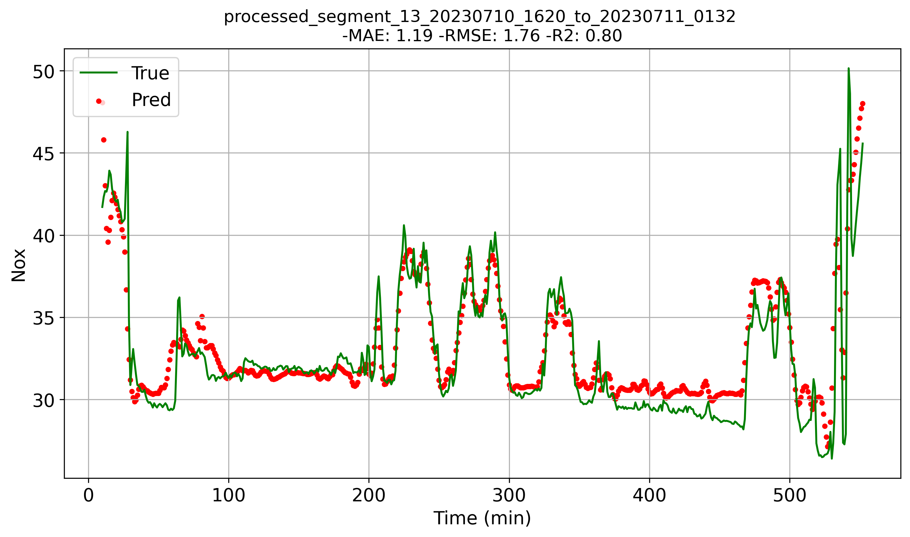
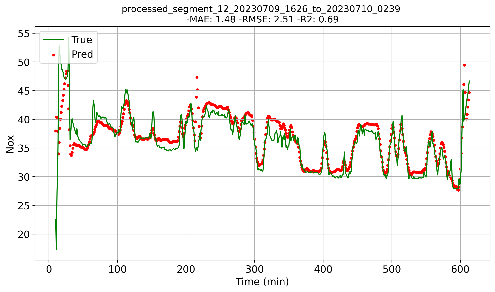

# ⚙️ EmissionMind: Data-Driven Gas Turbine Emission Prediction Framework

---
**EmissionMind** is an intelligent emission prediction system
for $gas turbines$, 
focusing on real-time and high-precision forecasting of NOx, CO, and 
other regulated exhaust components.  
It leverages multi-channels physical sensor data
(e.g., load, pressure, temperature, humidity) to 
construct time-series features and predict emissions under 
varying operating conditions.  
The system is designed for deployment in plant-level 
monitoring, combustion tuning, 
and low-emission optimization scenarios.
---
## 🧠 Features

---
- 📈 Predict NOx emissions with physical sensor data only  
- 🔁 Multi-step emission forecasting using deep sequence models (RNN/GRU/LSTM)  
- 🛠️ Modularized pipeline for preprocessing, modeling, evaluation, and deployment  
- 📦 Exportable models for industrial integration or edge deployment  
- 📊 Visualization dashboards for emissions, working conditions, and model diagnostics

## 📁 Project Structure

---
```
Emission/
├── train.py                 # Training script for emission prediction models
├── predict.py               # Inference script
├── val.py                   # Evaluation and validation script
├── model/                  
│   └── RNN.py               # Optional nerual network frame i.e. RNN, GRU and LSTM.
├── utils/
│   ├── dataloader.py        # Create temperal sequential sets and loading.
│   ├── createDatasets.py    # Split segmentations and save to train/valid/test directionary.
│   ├── general.py           # Feature engineering and transformation
│   ├── preprocess.py        # Feature engineering and transformation
│   ├── torch_utils.py       # PyTorch-specific helper functions (e.g., early-stopping)
│   └── plots/               # Plotting, loss functions, config parsing, etc.
├── datasets/
│   ├── min-level/
│   │   ├── raw/             # Raw sensor and emission datasets
│   │   └── processed/       # Preprocessed datasets for training
│   └── second-level/
├── runs/                    # Model checkpoints, logs, metrics, plots
│   ├── train-reg/           
│   ├── inference-reg/       
│   └── val-reg/             
├── environment.yaml         # Conda environment configuration
├── requirements.txt         # pip dependencies (optional)
└── README.md                # Project documentation
```

## 📚 Technical Details

---
### 📁 1. Raw Data Overview
- **Source**: Logged sensor data from gas turbine testbed (or simulation outputs)  
- **Sampling Rate**: 1 min (or project-specific)  
- **Features (base)**:
  - `load`, `diffusion_valve_feedback`, `exhaust_temp`, 
  - `compressor_inlet_temp`, `turbine_exhaust_temp_10B`, 
  - `amb_temperature`,`NG_inlet_temp`, `exhaust_temp`, etc.
- **Labels**:
  - `NOx_in_flue_gas` (i.e. NOx)
- **Size**:
  - N test runs × T time steps × D input features

> _Note: Missing values interpolated; outliers removed using IQR filtering._
---
### 🧹 2. Data Preprocessing
- **Cleaning**:
  - Remove Nulls and duplicates
  - Clip or mask physically invalid values (e.g., NOx < 0.0 ppm)
- **Normalization**:
  - Per-feature Min-Max scaling or StandardScaler
- **Segmentation**:
  - Split with `time_col=Time`, `freq = 1min`
- **Label Strategy**:
  - Predict next-step emission level (regression)
  - Optional: multi-step average prediction
- **Feature Engineering**:
  - valve_share, etc.
  - $\Delta$T, $\Delta$P,
  - Rolling statistics (e.g., mean, std, gradient)

---
### 🧠 3. Model Architecture
- **Base Model**: GRU-based sequence regression
- **Input Format**: `[batch_size, num-steps, num_features]`
- **Architecture**:``` Input → GRU → FC → Digital Prediction```
- **Variants to Explore**:
  - GRU, LSTM, or RNN
  - Temporal Convolutional Network (TCN)
  - Hybrid CNN + RNN for early feature extraction

---
### ⚙️ 4. Hyperparameters & Training Settings
| Parameter           | Value                             |
|---------------------|-----------------------------------|
| Batch Size          | 32                                |
| Number Steps        | 10/20/30                          |
| Number Hiddens      | 32/64/96                          |
| RNN Layers          | 2                                 |
| Dropout             | 0.5                               |
| Optimizer           | Adam                              |
| Learning Rate       | 1e-3                              |
| Epochs              | 1000                              |
| Loss Function       | MSE (per output)                  |
| Early Stopping      | Patience = 20                     |
| Learning Rate Decay | StepLR(lr_period=50,lr_decay=0.9) |

> _All training runs are logged under `runs/`, including checkpoints and loss/metric plots._

---
## 🛠️ Installation

---
Clone the repository and create the Conda environment:
```
git clone git@github.com:zhangbiao1231/EmissionMind.git
cd EmissionMind
conda env create -f environment.yaml
conda activate emission_env
```
if you prefer pip:
```
pip install -r requirements.txt
```
## 🚀 Getting Started

### 🧹 Preprocess data and generate training sequences
```
python3 utils/dataLoader.py 
--filepath datasets/GT2_2024_selected_features_1min.csv
--input datasets/min-level/raw
--output datasets/min-level/processed
--ratios (0.75, 0.15, 0.1)
```
### 🏋️ Train the emission prediction model
```
python3 train.py --model-name gru --num-steps 20 --num-hiddens 64 
```
### 🔍 Run validation on val data
```
python3 val.py 
--data datasets/min-level/processed 
--weights runs/train-reg/exp18/best.pt 
```
### 🔍 Run inference on test data
```
python3 predict.py 
--source datasets/min-level/processed/test (or .../test/xx.csv ) 
--weights runs/train-reg/exp18/best.pt 
```
## 📊 Example Output

---
### 📄 Inference Log (Terminal Output)

``` 
Start processing file: XXX.csv
XXX.csv Inference: 100%|████████████| 599/599 [00:10<00:00, 100.22it/s]
FileName    Quantities   MAE   RMSE   R2   UnitTime
----------------------------------------------------
XX.csv         196       3.49  4.75  0.14  0.31        
XX.csv         589       1.56  2.21  0.60  0.30        
----------------------------------------------------
Avg {MAE:2.21, RMSE:3.02, R2: 0.51}                                 
Total Time: 30ms                               

- Results saved to runs/inference-reg/exp18
- Figs saved to runs/inference-reg/exp18/XX_plot.png
```
### 📊 Inference Visualization

---
The figure below shows the comparison between predicted flame states and ground truth over time. 
The prediction accuracy is annotated directly on the plot.

<div align="center">
  
  
</div>
<p align="center">
  <b>Figure:</b> Inference results on <code>segment_13.csv</code> (by GRU)and <code>segment_12.csv</code>(by LSTM) <br>
  R2: <b>0.8</b> and <b>0.69</b> respectively.
</p>

> ⚡ Average inference latency: < 0.5 ms

## 🌈 Conclusion

------------------------
- In this work, we used limited sensor data and carefully engineered derived 
features to establish a reliable dataset for emission prediction. 
Based on this foundation, we trained an efficient prediction system that performs 
well on both validation and test datasets. The model accurately captures emission 
trends with promising metrics and low inference latency(<0.5 ms), making it suitable for
real-time deployment in operation and maintenance diagnostic systems.

- Through extensive experiments with different hyperparameters and 
neural network architectures, we identified [GRU]() as the most effective model. 
The optimal configuration — with [num_steps=20]() and [num_hiddens=64]() — achieved 
the best performance, reaching an [R² = 0.8]() at valid datasets.
These results provide a $solid baseline$ for future fine-tuning and improvements.

- We hope this work can contribute to the development of gas turbine emission prediction. 
If you have better ideas or suggestions, we welcome collaboration and discussion.

  
## 📃 Citing

---
If you use this work in academic research, please cite it as:
@article{XX,
  title={XXX},
  author={Zebulon},
  journal={TXX},
  year={2025}
}

## 📬 Contact

---
Questions, suggestions, or collaboration inquiries?
> 📧 Email: 18856307989@163.com.cn